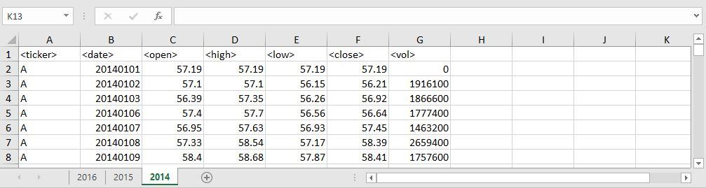
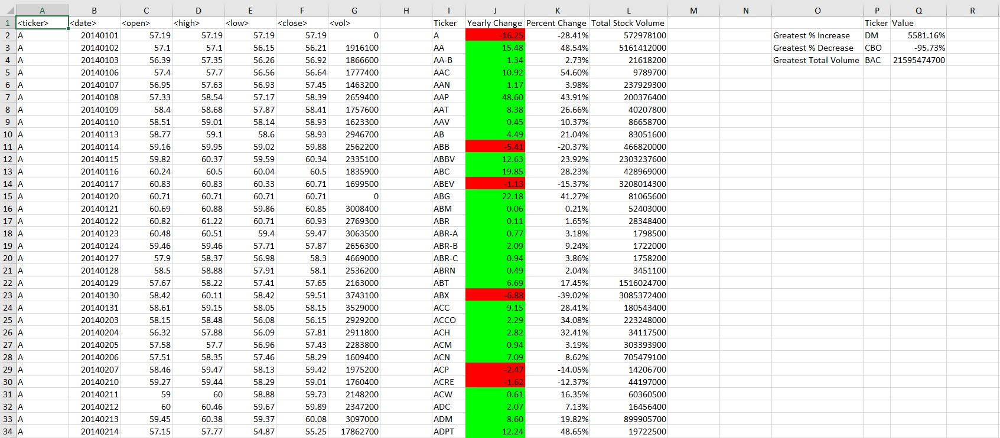
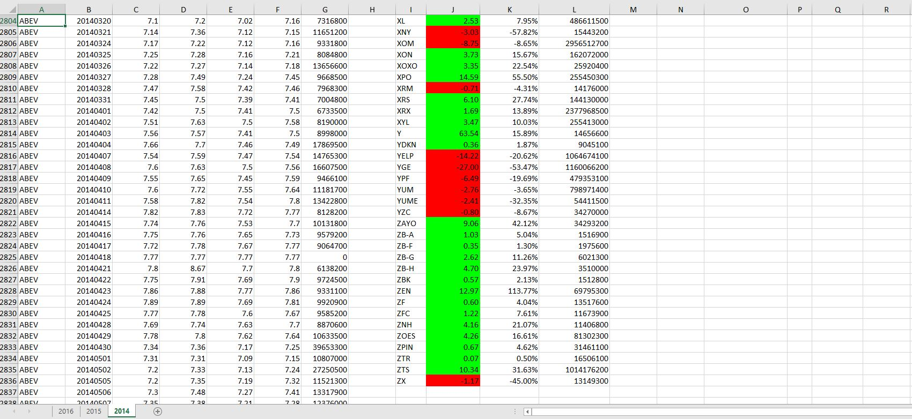
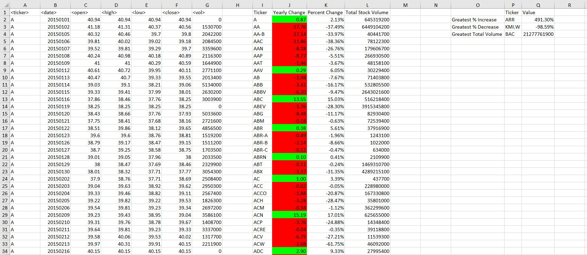
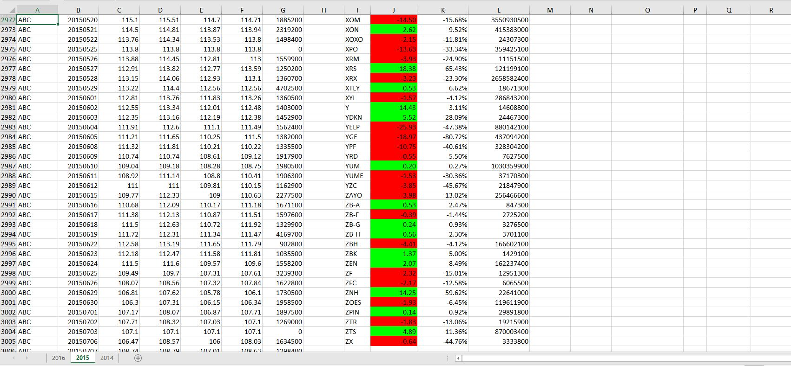
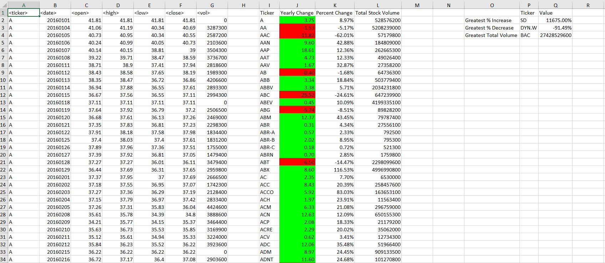
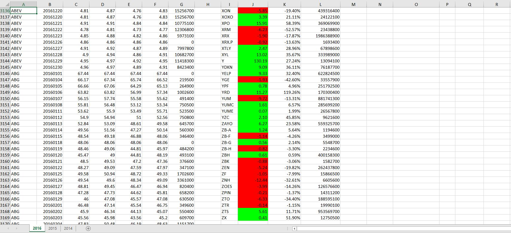

# Stock Data Analysis with VBA
VBA project for Monash Data Analytics Boot Camp

The purpose of this project was to use VBA scripting to analyze real stock market data.

# Data

There were two key sources of data used:

* [Test Data](Resources/alphabetical_testing.xlsx) - short version of the main dataset used for script testing

* [Stock Data](Resources/Multiple_year_stock_data.xlsx) - main dataset: .xlsx file which contains stock data for 2014, 2015 and 2016

# Analysis

* Loop through all the stocks for one year and output the following information:

  * The ticker symbol.

  * Yearly change from opening price at the beginning of a given year to the closing price at the end of that year.

  * The percent change from opening price at the beginning of a given year to the closing price at the end of that year.

  * The total stock volume of the stock.

* Apply conditional formatting that will highlight positive change in green and negative change in red.

* Return the stock with the "Greatest % increase", "Greatest % decrease" and "Greatest total volume".

### 2014:

### 2015:

### 2016:

# Demo

To run the examples locally, save the chosen data file as Excel Macro-Enabled Workbook, go to `Developer` tab, then open `Visual Basic`, import and run the `Homework_02-VBA_MilenaH` VBScript Script File.

# Used Tools
 * VBA

#

#### Contact: mil.haszek@gmail.com